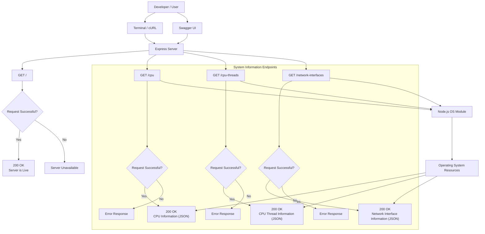

# System Information API

## Overview

System Information API is a Node.js and Express.js application that exposes system-level information through REST API endpoints. The application uses Node.js's built-in `os` module to retrieve CPU, memory, operating system, and network interface information.

## Features

* Operating System Information
* CPU Information
* CPU Thread Statistics
* Network Interface Information
* Swagger API Documentation
* CORS Enabled

## Tech Stack

* Node.js
* Express.js
* OS Module
* Swagger UI Express
* CORS

## Installation

```bash
npm install
```

## Running the Application

```bash
node index.js
```

Server runs on:

```text
http://localhost:9009
```

Swagger Documentation:

```text
http://localhost:9009/api-docs
```

## API Endpoints

### GET /

Returns server health status.

Response:

```json
{
  "message": "Server is Live"
}
```

### GET /cpu

Returns general system information.

Response Fields:

* Architecture
* Operating System Type
* Operating System Version
* System Uptime
* Hostname
* Total Memory
* Free Memory

### GET /cpu-threads

Returns detailed information about all logical CPU threads.

Response Fields:

* Thread Number
* CPU Model
* CPU Speed
* User Time
* Nice Time
* System Time
* Idle Time
* IRQ Time

### GET /network-interfaces

Returns information about all available network interfaces.

Response Fields:

* Interface Name
* Address
* Family
* MAC Address
* Netmask
* Internal Status
* CIDR

---

# Architechture

- Made using Mermaid

