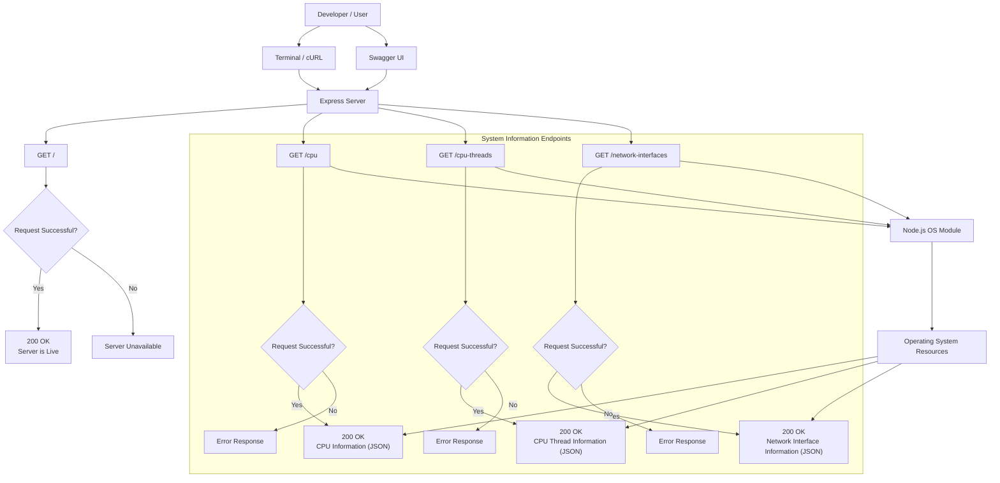

```mermaid
flowchart TD

    User[Developer / User]

    User --> Terminal[Terminal / cURL]
    User --> Swagger[Swagger UI]

    Terminal --> Express[Express Server]
    Swagger --> Express

    Express --> Root["GET /"]
    Express --> CPU["GET /cpu"]
    Express --> CPUThreads["GET /cpu-threads"]
    Express --> Network["GET /network-interfaces"]

    %% Root Endpoint
    Root --> CheckRoot{"Request Successful?"}
    CheckRoot -->|Yes| RootSuccess["200 OK<br/>Server is Live"]
    CheckRoot -->|No| RootFailure["Server Unavailable"]

    %% API Endpoints
    subgraph System Information Endpoints

        CPU --> CheckCPU{"Request Successful?"}
        CheckCPU -->|Yes| CPUSuccess["200 OK<br/>CPU Information (JSON)"]
        CheckCPU -->|No| CPUFailure["Error Response"]

        CPUThreads --> CheckCPUThreads{"Request Successful?"}
        CheckCPUThreads -->|Yes| CPUThreadsSuccess["200 OK<br/>CPU Thread Information (JSON)"]
        CheckCPUThreads -->|No| CPUThreadsFailure["Error Response"]

        Network --> CheckNetwork{"Request Successful?"}
        CheckNetwork -->|Yes| NetworkSuccess["200 OK<br/>Network Interface Information (JSON)"]
        CheckNetwork -->|No| NetworkFailure["Error Response"]

    end

    %% Data Source
    CPU --> OS[Node.js OS Module]
    CPUThreads --> OS
    Network --> OS

    OS --> System[Operating System Resources]

    System --> CPUSuccess
    System --> CPUThreadsSuccess
    System --> NetworkSuccess
```