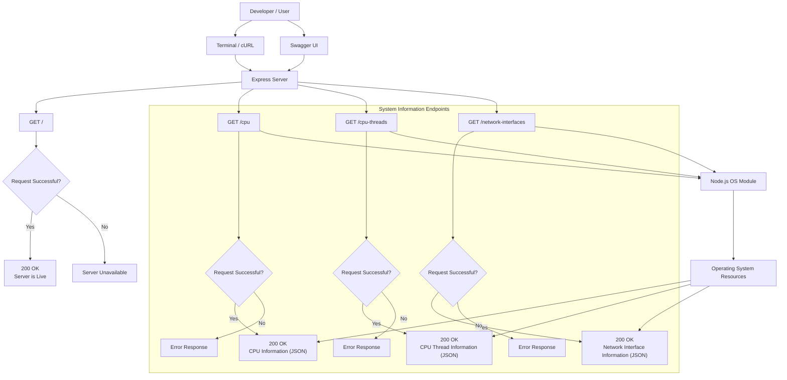

# 🚀 System Information API

A lightweight REST API built with **Node.js** and **Express.js** that provides detailed information about the host machine using Node.js's built-in **OS Module**.

---

# 📖 Table of Contents

* Project Overview
* Features
* Technology Stack
* Project Structure
* Installation Guide
* Running the Application
* Verifying the Application
* API Endpoints
* Architecture
* Future Improvements

---

# 📌 Project Overview

The System Information API exposes system-level information through REST endpoints.

Using Node.js's built-in `os` module, the application retrieves:

* Operating System Information
* CPU Information
* CPU Thread Statistics
* Memory Statistics
* Network Interface Information

This project was created to explore backend development concepts, REST APIs, Express.js, and system monitoring using Node.js.

---

# ✨ Features

✅ CPU Information

✅ CPU Thread Statistics

✅ Memory Information

✅ Network Interface Information

✅ Swagger Documentation

✅ CORS Support

✅ JSON-Based API Responses

---

# 🛠 Technology Stack

| Technology | Purpose               |
| ---------- | --------------------- |
| Node.js    | Runtime Environment   |
| Express.js | Web Framework         |
| OS Module  | System Information    |
| Swagger UI | API Documentation     |
| CORS       | Cross-Origin Requests |

---

# 📁 Project Structure

```text
System-Information-API/
│
├── index.js
├── swagger.json
├── package.json
├── package-lock.json
├── README.md
└── node_modules/
```

---

# ⚙️ Installation Guide

## Step 1: Clone the Repository

```bash
git clone <repository-url>
```

## Step 2: Navigate to the Project Folder

```bash
cd System-Information-API
```

## Step 3: Install Dependencies

```bash
npm install
```

At this point all required packages will be downloaded and installed automatically.

---

# ▶️ Running the Application

Start the Express server:

```bash
node index.js
```

If everything starts successfully, you should see in your console: 

```text
Your app is running at http://localhost:9009
```

---

# ✅ Verifying the Application

## Server Health Check

Open:

```text
http://localhost:9009/
```

Expected Output:

```text
Server is Live
```

---

## Swagger Documentation

Open:

```text
http://localhost:9009/api-docs
```

You should see the Swagger UI dashboard where all endpoints can be tested directly.

---

## Test Using Browser

### CPU Information

```text
http://localhost:9009/cpu
```

### CPU Thread Information

```text
http://localhost:9009/cpu-threads
```

### Network Interface Information

```text
http://localhost:9009/network-interfaces
```

---

## Test Using Terminal

### CPU Endpoint

```bash
curl http://localhost:9009/cpu
```

### CPU Threads Endpoint

```bash
curl http://localhost:9009/cpu-threads
```

### Network Interfaces Endpoint

```bash
curl http://localhost:9009/network-interfaces
```

---

# 🌐 API Endpoints

| Method | Endpoint            | Description                             |
| ------ | ------------------- | --------------------------------------- |
| GET    | /                   | Server Health Check                     |
| GET    | /cpu                | General CPU & System Information        |
| GET    | /cpu-threads        | Detailed Logical CPU Thread Information |
| GET    | /network-interfaces | Network Interface Information           |

---

## GET /

Checks whether the server is running.

### Successful Response

```json
"Server is Live"
```

---

## GET /cpu

Returns:

* System Architecture
* Operating System Type
* Operating System Version
* System Uptime
* Hostname
* Total Memory
* Available Memory

---

## GET /cpu-threads

Returns:

* Thread Number
* CPU Model
* CPU Speed
* User Time
* Nice Time
* System Time
* Idle Time
* IRQ Time

for every logical CPU thread detected on the machine.

---

## GET /network-interfaces

Returns:

* Interface Name
* IP Address
* Address Family
* MAC Address
* Netmask
* CIDR Information
* Internal Status

for every network interface available on the system.

---

# Bash Scripts

The project includes helper bash scripts for setup, execution, and testing.

| Script | Purpose |
|----------|----------|
| setup.sh | Installs all required dependencies |
| start.sh | Starts the Express server |
| test-api.sh | Tests all API endpoints |

## Usage

```bash
bash setup.sh
bash start.sh
bash test-api.sh

---

# Architechture

- Made using Mermaid


---

# 👨‍💻 Author

Developed using **Node.js**, **Express.js**, and the **OS Module** to provide a lightweight and educational system information API.

